<div align="center">


---

[](#)
[](#)
[](./LICENSE)

[](https://horizonrobotics.github.io/robot_lab/holomotion/)
[](https://deepwiki.com/HorizonRobotics/HoloMotion)
[](https://horizonrobotics.feishu.cn/docx/Xs3cdEI8bo1EZuxUfzjckTgKn2c)

<!-- [](https://arxiv.org/abs/2025.00000) -->
<!-- [](https://arxiv.org/abs/2025.00000) -->

</div>

# HoloMotion: A Foundation Model for Whole-Body Humanoid Control

## NEWS

- [2026.01.06] The v1.1 version of HoloMotion has been released, representing a major step forward toward a fully engineered, stable, and reproducible humanoid motion intelligence system.

- [2025.11.05] The v1.0 version of HoloMotion has been released, and the WeChat user group is now open! Please scan the [QR Code](https://horizonrobotics.feishu.cn/docx/Xs3cdEI8bo1EZuxUfzjckTgKn2c) to join.
<!-- <p align="center">
  
</p> -->

## Introduction

HoloMotion is a foundation model for humanoid robotics, designed to fullfill robust, real-time, and generalizable whole-body control.

Our framework provides an end-to-end solution, encompassing the entire workflow from data curation and motion retargeting to distributed model training, evaluation, and seamless deployment on physical hardware via ROS2. HoloMotion's modular architecture allows for flexible adaptation and extension, enabling researchers and developers to build and benchmark agents that can imitate, generalize, and master complex whole-body motions.

For those at the forefront of creating the next generation of humanoid robots, HoloMotion serves as a powerful, extensible, and open-source foundation for achieving whole-body control.

---

### 🛠️ Roadmap: Progress Toward Any Humanoid Control

We envision HoloMotion as a general-purpose foundation for humanoid motion and control. Its development is structured around four core generalization goals: Any Pose, Any Command, Any Terrain, and Any Embodiment. Each goal corresponds to a major version milestone.

| Version  | Target Capability | Description                                                                                                                         |
| -------- | ----------------- | ----------------------------------------------------------------------------------------------------------------------------------- |
| **v1.0** | 🔄 Any Pose       | Achieve robust tracking and imitation of diverse, whole-body human motions, forming the core of the imitation learning capability.  |
| **v2.0** | ⏳ Any Command    | Enable language- and task-conditioned motion generation, allowing for goal-directed and interactive behaviors.                      |
| **v3.0** | ⏳ Any Terrain    | Master adaptation to uneven, dynamic, and complex terrains, enhancing real-world operational robustness.                            |
| **v4.0** | ⏳ Any Embodiment | Generalize control policies across humanoids with varying morphologies and kinematics, achieving true embodiment-level abstraction. |

> Each stage builds on the previous one, moving from motion imitation to instruction following, terrain adaptation, and embodiment-level generalization.

## Pipeline Overview

```mermaid
flowchart LR
    A["🔧 1. Environment Setup<br/>Dependencies & conda"]

    subgraph dataFrame ["DATA"]
        B["📊 2. Dataset Preparation<br/>Download & curate"]
        C["🔄 3. Motion Retargeting<br/>Human to robot motion"]
        B --> C
    end

    subgraph modelFrame ["TRAIN & EVAL"]
        D["🧠 4. Model Training<br/>Train with HoloMotion"]
        E["📈 5. Evaluation<br/>Test & export"]
        D --> E
    end

    F["🚀 6. Deployment<br/>Deploy to robots"]

    A --> dataFrame
    dataFrame --> modelFrame
    modelFrame --> F

    classDef subgraphStyle fill:#f9f9f9,stroke:#333,stroke-width:2px,stroke-dasharray:5 5,rx:10,ry:10,font-size:16px,font-weight:bold
    classDef nodeStyle fill:#e1f5fe,stroke:#0277bd,stroke-width:2px,rx:10,ry:10

    class dataFrame,modelFrame subgraphStyle
    class A,B,C,D,E,F nodeStyle
```



## Quick Start

### 🔧 1. Environment Setup [[Doc](docs/environment_setup.md)]

Set up your development and deployment environments using Conda. This initial step ensures all dependencies are correctly configured for both training and real-world execution.

If you only intend to use our pretrained models, you can skip the training environment setup and proceed directly to configure the deployment environment. See the [real-world deployment documentation](docs/realworld_deployment.md) for details.

### 📊 2. Dataset Preparation [[Doc](docs/smpl_data_curation.md)]

Acquire and process large-scale motion datasets. Our tools help you curate high-quality data by converting it to the AMASS-compatible smpl format and filtering out anomalies using kinematic metrics.

### 🔄 3. Motion Retargeting [[Doc](docs/motion_retargeting.md)]

Translate human motion data into robot-specific kinematic data. Our pipeline leverages [GMR](https://github.com/YanjieZe/GMR) to map human movements onto your robot's morphology, producing optimized HDF5 datasets ready for high-speed, distributed training.

### 🧠 4. Model Training [[Doc](docs/train_motion_tracking.md)]

Train your foundation model using our reinforcement learning framework. HoloMotion supports versatile training tasks, including motion tracking and velocity tracking.

### 📈 5. Evaluation [[Doc](docs/evaluate_motion_tracking.md)]

Evaluate your trained policies in IsaacLab. Visualize performance, and export trained models in ONNX format for seamless deployment.

### 🚀 6. Real-world Deployment [[Doc](docs/realworld_deployment.md)]

Our ROS2 package facilitates the deployment of the exported ONNX models, enabling real-time control on hardware like the Unitree G1.

## Join Us

We are hiring full-time engineers, new graduates, and interns who are excited about humanoid robots, motion control, and embodied intelligence.
Send your resume by scanning the **WeChat** QR code below to get in touch with us.

<p align="center">
  
</p>

## Citation

```
@software{HoloMotion,
  author = {Maiyue Chen, Kaihui Wang, Bo Zhang, Yi Ren, Zihao Zhu, Xihan Ma, Qijun Huang, Zhiyuan Yang, Yucheng Wang, Zhizhong Su},
  title = {HoloMotion: A Foundation Model for Whole-Body Humanoid Control},
  year = {2026},
  month = January,
  version = {1.1.0},
  url = {https://github.com/HorizonRobotics/HoloMotion},
  license = {Apache-2.0}
}
```

## License

This project is released under the **[Apache 2.0](https://img.shields.io/badge/license-Apache--2.0-blue.svg)** license.

## Acknowledgements

This project is built upon and inspired by several outstanding open source projects:

- [GMR](https://github.com/YanjieZe/GMR)
- [BeyondMimic](https://github.com/HybridRobotics/whole_body_tracking/tree/dcecabd8c24c68f59d143fdf8e3a670f420c972d)
- [ASAP](https://github.com/LeCAR-Lab/ASAP)
- [Humanoidverse](https://github.com/LeCAR-Lab/HumanoidVerse)
- [PHC](https://github.com/ZhengyiLuo/PHC?tab=readme-ov-file)
- [ProtoMotion](https://github.com/NVlabs/ProtoMotions/tree/main/protomotions)
- [Mink](https://github.com/kevinzakka/mink)
- [PBHC](https://github.com/TeleHuman/PBHC)
