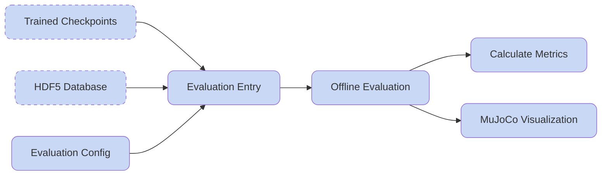

## Evaluate the Motion Tracking Model

After training for a while and saving model checkpoints, it is necessary to run the evaluation pipeline to get to know your model performance both visually and quantitatively. HoloMotion also bakes the model exporting process for later deployment in the evaluation pipeline.

**Overall Workflow:**



### 1 Offline Evaluation

```bash
bash ./holomotion/scripts/evaluation/eval_motion_tracking.sh
```

Update the evaluation script by setting `checkpoint_path` (e.g., `logs/Holomotion/model_1000.pt`) and `eval_h5_dataset_path`.

### 2 Calculate Metrics

Process the `.npz` files generated in the previous step and convert them into a final quantitative JSON metrics report:

```bash
bash ./holomotion/scripts/evaluation/calc_offline_eval_metrics.sh
```

- `npz_dir`: Path to the folder containing `.npz` result files. 
- `dataset_suffix`: Evaluation dataset name, set to differentiate different datasets.

### 3 MuJoCo Visualization

Generate video outputs to validate the motion tracking quality from the `.npz` result files by setting the `motion_npz_root` to the evaluation npz folder. Note that in order to properly visualize the recorded robot data, you should set the `+key_prefix="robot_"` .

```bash
bash ./holomotion/scripts/motion_retargeting/run_motion_viz_mujoco.sh
```

- `motion_npz_root`: Path to the folder containing `.npz` result files. 
- `video_rendering/{motion_name}.mp4` files in the corresponding `.npz` result files.

### 4 Export Trained Model to ONNX

To deploy our policy to real world robots, we need to convert the pytorch module into ONNX format, which is supported by most inference frameworks.
After running the evaluation script, the `.onnx` file will be generated and saved to the checkpoint directory:

```
logs/HoloMotion/your_checkpoint_dir/
├── config.yaml
├── exported
│   └── model_10000.onnx
└── model_10000.pt
```
