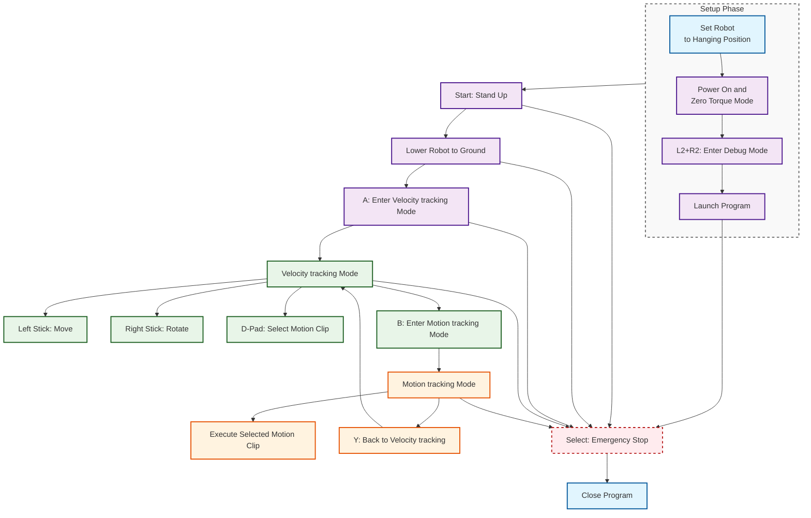

# HoloMotion Deployment Guide

This guide describes how to set up the deployment environment and run the trained policy on a physical Unitree G1 robot.

## Robot Configuration for 29 DOF
The 29 DOF configuration includes:

- 12 leg joints (6 per leg)
- 3 waist joints (yaw, roll, pitch)
- 14 arm joints (7 per arm)

---

## Deployment Options

This guide provides two deployment methods:

| Deployment Method                               | Target Platform   |
| ----------------------------------------------- | ----------------- |
| [Laptop Deployment](#laptop-deployment)         | Laptop/Desktop PC |
| [PC2 Docker Deployment](#pc2-docker-deployment) | G1 Robot's PC2    |

Choose the appropriate method based on your setup:

- **For laptop/desktop deployment**: Follow the [Laptop Deployment](#laptop-deployment) section
- **For PC2 on robot hardware**: Follow the [PC2 Docker Deployment](#pc2-docker-deployment) section

### ⚠️ Important Safety Notice

> **For safety reasons, it is strongly recommended to remove the dexterous hands before running the policy.**

---

## Laptop Deployment

### Quick Environment Setup

#### Prerequisites

Ensure the following are installed before proceeding:

- Anaconda or Miniconda
- ROS 2 Humble installed at `/opt/ros/humble`
- MCAP for efficient ROS 2 data recording
- Unitree ROS 2 SDK installed at `~/unitree_ros2/`

#### One-Click Deployment

```bash
cd <your_holomotion_repo_path>/deployment
chmod +x deploy_environment.sh
./deploy_environment.sh
```

This script will:

- Create a new conda environment (with CUDA support if available)
- Install Python packages from `requirements/requirements_deploy.txt`
- Install Unitree SDK Python bindings
- Build the ROS 2 workspace under `unitree_g1_ros2_29dof/`

---

### Deploy on Physical G1 Robot (Laptop)

### Setup Overview

The deployment process consists of two types of steps:

| **One-Time Setup** (per computer) | **Every Run** (each time you use the robot) |
| --------------------------------- | ------------------------------------------- |
| Step 1: Network Configuration     | Step 3: Power On & Initialize Robot         |
| Step 2: Launch Script Setup       | Step 4: Launch Policy Controller            |

> **Note**: Once you complete Steps 1-2, you only need to do Steps 3-4 for each robot session!

### Step 1: Connect and Configure Network

#### Prerequisites for Network Setup:

1. **Power on the robot** and wait for it to fully boot
2. **Use an Ethernet cable** to connect your PC to the robot's LAN port
3. **Ensure both devices are powered on** during configuration

#### Network Configuration:

Configure your PC's network interface with the following static IP settings:

- **Static IP**: `192.168.123.222`
- **Netmask**: `255.255.255.0`
- **Gateway**: (leave empty)

#### Automatic Configuration Script:

You can use the following script to configure it automatically (use command `nmcli con show` to check your actual connection name):

<details>
<summary>Click to view set_static_ip.sh</summary>

```bash
#!/bin/bash

# Replace with your actual connection name (use `nmcli con show` to check)
CON_NAME="Wired connection 1"
IP_ADDRESS="192.168.123.222"
NETMASK="24"
GATEWAY=""

nmcli con modify "$CON_NAME" ipv4.addresses "$IP_ADDRESS/$NETMASK"
nmcli con modify "$CON_NAME" ipv4.method manual

if [ -n "$GATEWAY" ]; then
  nmcli con modify "$CON_NAME" ipv4.gateway "$GATEWAY"
fi

nmcli con modify "$CON_NAME" ipv4.dns ""
nmcli con down "$CON_NAME" && nmcli con up "$CON_NAME"
```

</details>

---

### Step 2: Prepare Launch Script

#### Configure Network Interface:

1. **Check your network interface name** (while connected to the robot):

   ```bash
   ifconfig
   ```

   Look for the interface connected to the robot (e.g., `enxf8e43ba00afd`, `eth0`, `enp0s31f6`)

2. **Update the launch configuration**:
   ```bash
   # Edit the launch file
   nano <your_holomotion_repo_path>/deployment/unitree_g1_ros2_29dof/src/launch/holomotion_29dof_launch.py
   ```
   Find and update the `network_interface` parameter with your actual interface name.


---

### Step 3: Power On and Initialize the Robot

> **Do this every time** you want to run the robot.

#### Robot Initialization Sequence for 29 DOF:

1. **Power on the robot** - Start the robot in the **hanging position**
2. **Wait for zero torque mode** - The robot will automatically enter zero torque mode (joints feel loose)
3. **Connect your computer** - Use the same Ethernet cable to connect to the robot's LAN port
4. **Enter debugging mode** - On the remote controller, press `L2 + R2` simultaneously. Note: the new deployment automatically enters this mode on startup, so manual entry is usually not required.

---

### Step 4: Launch the Policy Controller

#### Step 4 Preflight Checklist

Before running, ensure the following are ready.

- Model folders configured in `g1_29dof_holomotion.yaml` exist
  - `motion_tracking_model_folder`: under `src/models/`
  - `velocity_tracking_model_folder`: under `src/models/`
- Motion data directory exists and contains .npz files (retargeted results)
  - `motion_clip_dir`: under `src/motion_data/`
- Config file path used by launch is correct

#### One-click start

```bash
cd <your_holomotion_repo_path>/deployment/unitree_g1_ros2_29dof
bash launch_holomotion_29dof.sh
```

> **Success indicator**: On startup, the robot joints should remain in zero torque state and feel free to move.

#### Motion Control Modes

The 29 DOF robot operates in two main modes:

| Mode    | How to Enter                                                          | Controls                                                                                                                     | Switch             |
| ------- | --------------------------------------------------------------------- | ---------------------------------------------------------------------------------------------------------------------------- | ------------------ |
| Velocity tracking | 1) Press Start to stand up, then press A<br/>2) From motion tracking: press Y | Left stick: move (vx, vy)<br/>Right stick: rotate (yaw)<br/>D-Pad: select motion clip (Left=first, Right=last, Up=prev, Down=next) | B: enter motion tracking   |
| Motion tracking | Press B                                                               | Executes selected motion clip automatically                                                                                        | Y: back to velocity tracking |

#### Control Flow

Here is the robot control flowchart for 29 DOF:



#### Configuration Files (used by Step 4)

**System Configuration**

- File: `holomotion/deployment/unitree_g1_ros2_29dof/src/config/g1_29dof_holomotion.yaml`
- Key parameters:
  - `motion_tracking_model_folder`: motion tracking model folder under `models/`
  - `velocity_tracking_model_folder`: velocity tracking model folder under `models/`
  - `motion_clip_dir`: motion clip data folder under `src/`

**Adding New Motion Tracking Models**

1. Create a new folder under `models/` based on the following example model folder structure (e.g., `models/your_model_dir_name/`)
2. Update `motion_tracking_model_folder` in the config file
3. Ensure the motion clip data files are in the `motion_clip_dir`

Example model folder structure (motion model):

```bash
Holomotion/deployment/unitree_g1_ros2_29dof/src/models/your_model_dir_name
├── config.yaml
├── exported
    └── your_model_name.onnx
```

---

### Safety Notice

This deployment is intended for demonstration only. It is not a production-grade control system. Do not interfere with the robot during operation. If unexpected behavior occurs, exit control immediately via the controller or keyboard to ensure safety.

To stop the control process, press `Select` or use `Ctrl+C` in the terminal.

---

## PC2 Docker Deployment

### Setup Overview

The deployment process consists of two types of steps:

| **One-Time Setup** (per PC2) | **Every Run** (each time you use the robot) |
| ----------------------------- | -------------------------------------------- |
| Step 1: Configure Docker      | Step 4: Start Docker Container              |
| Step 2: Load Docker Image     | Step 5: Power On & Initialize Robot         |
| Step 3: Configure Launch File Network Interface     | Step 6: Launch Policy Controller            |

> **Note**: Once you complete Steps 1-3, you only need to do Steps 4-6 for each robot session!

### System Requirements

- **Platform**: NVIDIA Jetson Orin
- **JetPack**: 5.1
- **Ubuntu**: 20.04
- **ROS 2**: Foxy
- **Docker**: Installed with NVIDIA Container Runtime support

### Step 1: Configure Docker for NVIDIA Runtime

Modify `/etc/docker/daemon.json`:

```json
{
  "runtimes": {
    "nvidia": {
      "path": "nvidia-container-runtime",
      "runtimeArgs": []
    }
  },
  "default-runtime": "nvidia"
}
```

Restart Docker and verify:

```bash
sudo systemctl restart docker
sudo docker info | grep -i runtime
```

### Step 2: Load Docker Image

Pull the image from dockerhub with:

```bash
docker pull horizonrobotics/holomotion:orin_foxy_jp5.1_docker_humble_deploy_20260105
```

Or if you have the image locally, tag it appropriately:

```bash
docker tag <your_image_name> holomotion:orin_foxy_jp5.1_docker_humble_deploy_20260105
```

### Step 3: Configure Launch File Network Interface:


1. **Check your network interface name on the robot**:

   ```bash
   ifconfig
   ```

   Look for the interface with IP `192.168.123.164`. The interface is typically `eth0`.

2. **Update the launch configuration** if your interface is not `eth0`:

   ```bash
   nano <your_holomotion_repo_path>/deployment/unitree_g1_ros2_29dof/src/launch/holomotion_29dof_launch.py
   ```

   Find line 103 and update the `network_interface` parameter:
   ```python
   network_interface = "eth0"  # Change to your actual interface name
   ```

### Step 4: Start Docker Container

> **Important**: You need to run this step **every time** you want to use the robot. The script will automatically remove any existing container and start a fresh one.

```bash
cd <your_holomotion_repo_path>/deployment/unitree_g1_ros2_29dof
bash start_container.sh
```

**When prompted, enter the holomotion repository path:**

- The script will ask: `Please enter the holomotion local repository path:`
- Enter the full path to your holomotion repository, for example:
  - `/home/unitree/HoloMotion` (if the repository is at this location)
  - Or the actual path where your holomotion repository is located


### Step 5: Power On and Initialize Robot

> **Do this every time** before launching the policy controller.

1. Put the robot in hanging position
2. Wait for zero torque mode
3. Press `L2 + R2` on remote controller for debug mode 

### Step 6: Launch Policy Controller

> **Do this every time** you want to run the robot (after Steps 4 and 5).

**Preflight Checklist**

Before running, ensure the following are ready.

- Model folders configured in `g1_29dof_holomotion.yaml` exist
  - `motion_tracking_model_folder`: under `src/models/`
  - `velocity_tracking_model_folder`: under `src/models/`
- Motion data directory exists and contains .npz files (retargeted results)
  - `motion_clip_dir`: under `src/motion_data/`
- Config file path used by launch is correct

**One-click start in the docker**

```bash
cd /home/unitree/holomotion/deployment/unitree_g1_ros2_29dof
bash launch_holomotion_29dof_docker.sh
```

> **Note**: The control flow is the same as described in the [Control Flow](#control-flow) section above.


---

### Safety Notice

This deployment is intended for demonstration only. It is not a production-grade control system. Do not interfere with the robot during operation. If unexpected behavior occurs, exit control immediately via the controller or keyboard to ensure safety.

To stop the control process:

- Press `Select` on the remote controller, or
- Use `Ctrl+C` in the terminal (inside Docker container)
