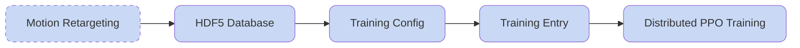

## Train the Motion Tracking Model

After completing motion retargeting, you can train a motion tracking model with HoloMotion using the following process.

**Overall Workflow:**



### 1. Train the Motion Tracking Model

The training entry point is `holomotion/src/training/train.py`, which uses the training config to start distributed training across multiple GPUs.

#### 2.1 Prepare the Training Config

Use the demo config at `holomotion/config/training/motion_tracking/train_g1_29dof_motion_tracking.yaml` as a template. Key configuration groups to modify (configs are located in the `holomotion/config/` directory):

- **`/algo`**: Algorithm settings (PPO) and network configurations
- **`/robot`**: Robot-specific config including DOF, body links, and control parameters
- **`/env`**: Environment settings including motion sampling and curriculum learning
- **`/env/observations`**: Observation dimensions, noise, and scaling for the policy
- **`/env/rewards`**: Reward function definitions
- **`/env/domain_randomization`**: Domain randomization settings (start with `NO_domain_rand`)
- **`/env/terrain`**: Terrain configuration

```yaml
# @package _global_

defaults:
  - /training: train_base
  - /algo: ppo
  - /robot: unitree/G1/29dof/29dof_training_isaaclab
  - /env: motion_tracking
  - /env/terminations: termination_motion_tracking
  - /env/observations: motion_tracking/obs_motion_tracking
  - /env/rewards: motion_tracking/rew_motion_tracking
  - /env/domain_randomization: domain_rand_small
  - /env/terrain: isaaclab_plane

project_name: HoloMotion
```

#### 2.2 Train your Policy

Review and modify the training script at `holomotion/scripts/training/train_motion_tracking.sh`. Ensure `config_name` match your training config and LMDB database directory.

Start training by running:

```shell
bash holomotion/scripts/training/train_motion_tracking.sh

# or

bash holomotion/scripts/training/train_velocity_tracking.sh
```

Note that IsaacLab relies on internet connections to pull assets from Nvidia's cloud storage. If you encountered stuck at scene creation, it is very likely that you can't access the cloud-hosted assets. Turn on your proxy and try again can solve the issue.

### Training Tips

#### How to use less GPU ?

Training requires significant GPU memory. Reduce `num_envs` if your GPU has limited GRAM. This will reduce both the rollout burden and the PPO training consumption, at the risk of significantly less stable policy optimization process.

#### How to start multiple training session ?

In cases where you would like to start multiple training sessions, you should explicitly add the `--main_process_port=port_number` option in the training entry bash script to avoid port conflict of the accelerate backend. And this `port_number` **can not** be `0` .

If you would like to run training on a specific GPU, just modify the GPU id in the `export CUDA_VISIBLE_DEVICES="X"` statement.

#### How to set the save/log intervals ?

You may want to have more or less frequent logging and model dumping intervals. You can alter these intervals by adding the following options:

- `algo.config.save_interval=X` : The checkpoint will be saved every `X` learning iterations.
- `algo.config.log_interval=Y`: The logging information will be displayed every `Y` learning iterations.

#### Where is the checkpoint dumped ?

By default, the model checkpoint will be dumped into a folder named `logs/HoloMotion`. You can change this path by explictly setting `project_name=X`, which results in dumping the checkpoints into the `logs/X` directory.

#### How to resume training from a checkpoint ?

To resume training from a pretrained checkpoint, you can find the checkpoint in the log directory, and then add the option like this: `checkpoint=logs/HoloMotion/20250728_214414-train_unitree_g1_21dof_teacher/model_X.pt`
